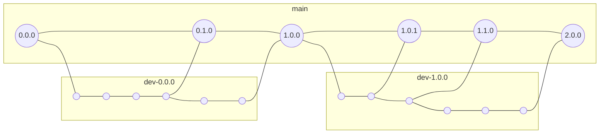

<!-- markdownlint-disable-file MD024 -->

# Development

## Development Computer Setup (Example)

This section describes an example development computer environment. The environment as described below has been used in the initial setup of the project.

We assume a Mac-computer with latest macOS installed (at the time of writing this it's macOS Big Sur 11.6.1). On this computer, the following tools could be used:

1. Docker Desktop >4.2.0 (70708) for macOS from [Docker Hub](https://hub.docker.com/?overlay=onboarding). A very good [Docker tutorial](https://docker-curriculum.com) may help in using Docker.
2. Git >2.21.0 for macOS from [git homepage](https://git-scm.com/download/mac)
3. iTerm2 >3.4.12 as terminal from [iterm2 homepage](https://www.iterm2.com)
4. Firefox >94.0.1 as browser from [Mozilla website](https://www.mozilla.org/de/firefox/all/#product-desktop-release)
5. Visual Studio Code >1.62.3 as editor from [VSC homepage](https://code.visualstudio.com)
6. Visual Studio Code plugins used:
    - [Python](https://marketplace.visualstudio.com/items?itemName=ms-python.python)
    - [Beautify](https://marketplace.visualstudio.com/items?itemName=HookyQR.beautify)
    - [Bracket Pair Colorizer 2](https://marketplace.visualstudio.com/items?itemName=CoenraadS.bracket-pair-colorizer-2)
    - [Docker](https://marketplace.visualstudio.com/items?itemName=ms-azuretools.vscode-docker)
    - [GitLens](https://marketplace.visualstudio.com/items?itemName=eamodio.gitlens)
    - [PrintCode](https://marketplace.visualstudio.com/items?itemName=nobuhito.printcode)
    - [Remote - Containers](https://marketplace.visualstudio.com/items?itemName=ms-vscode-remote.remote-containers)
    - [Todo Tree](https://marketplace.visualstudio.com/items?itemName=Gruntfuggly.todo-tree)
    - [YAML](https://marketplace.visualstudio.com/items?itemName=redhat.vscode-yaml)
    - [markdownlint](https://marketplace.visualstudio.com/items?itemName=DavidAnson.vscode-markdownlint)
    - [REST Client](https://marketplace.visualstudio.com/items?itemName=humao.rest-client)
    - [Rewrap](https://marketplace.visualstudio.com/items?itemName=stkb.rewrap)
    - [vscode-icons](https://marketplace.visualstudio.com/items?itemName=vscode-icons-team.vscode-icons)
    - [Even Better TOML](https://marketplace.visualstudio.com/items?itemName=tamasfe.even-better-toml)
    - [REST Client](https://marketplace.visualstudio.com/items?itemName=humao.rest-client)
    - [Markdown Preview Mermaid Support](https://marketplace.visualstudio.com/items?itemName=vstirbu.vscode-mermaid-preview)

Check diagramming support with [Mermaid](https://mermaid-js.github.io/mermaid/#/) for Markdown (in VS Code preview) by testing with the following mardown code:  

<!-- markdownlint-disable MD033 -->
<pre>```mermaid
graph TD;
    A-->B;
    A-->C;
    B-->D;
    C-->D;
```</pre>
<!-- markdownlint-enable MD033 -->


Preview the markdown in VSCode on macOS eihter by pressing `Command+Shift+V` (on Windows `CTRL+Shift+V`) or by showing side-by-side with `Command+K V` (on Windows `CTRL+K V`).

Note: A good [Markdown Cheatsheet](https://github.com/adam-p/markdown-here/wiki/Markdown-Cheatsheet).

## Versioning

Semantic versioning is used, following the rules of [SemVer](https://semver.org/).

Specifically, the following applies:

- Development phase starts with 0.1.0 and increments minor and patch until a first stable, production-ready version is reached.
- Git tags are prefixed with "v" in this project, so “v1.2.3” is a tag name and the semantic version is “1.2.3”

## Branching Strategy

The branching strategy tries to be as lean as possible, but still allow for a structured approach for as small team. It follows the following rules:

- "main" branch always contains the latest official stable, production-ready release; it always contains the release path of the highest major release according to semantic versioning.
- For each major release, a development branch exists, using the naming "dev-x.0.0", where x corresponds to the release branch developed for. The first development branch is "dev-0.0.0" until the first major release is done ("1.0.0"). Then, the development branch "dev-1.0.0" is created, where development continues.
- From version "1.0.0" onwards, all releases are merged into the "main" branch, but only for the latest development branch. Example: If "dev-1.0.0" and "dev-2.0.0" exist, where "dev-1.0.0" is an older release, which might still be undo support with security patches, "dev-2.0.0" represents the latest release, whose release are merged to "main".



## Github Project Setup

On GitHub's webinterface, the project `pyconfme` was created as fresh project with minimal initial files: `.gitignore` (GitHub's template for Python), License and Readme-file.

In GitHub's webinterface, the branch "dev-0.0.0" was created from "main"-branch. All initial development takes place in "dev-0.0.0" until the first stable release.

## Local Working Environment

In your projects' folder, check out the remote git-repository:

```bash
git clone https://github.com/bnaard/pyconfme.git
```

Then switch into current development branch (here as an example the branch `dev-0.0.0`):

```bash
cd pyconfme
git checkout dev-0.0.0 
```

Then open the project's folder in VSCode with the function "Open in Container...". The first time, the container is opened, choose the following initial options:

- Python 3.9 (OS "bullseye" at the time of writing)
- no nodejs environment
- no other additional software added to the image

Then set up the main configuration files of VS Code as follows and run "Rebuild Container...".

Dockerfile

```bash
# [Choice] Python version (use -bullseye variants on local arm64/Apple Silicon): 3, 3.10, 3.9, 3.8, 3.7, 3.6, 3-bullseye, 3.10-bullseye, 3.9-bullseye, 3.8-bullseye, 3.7-bullseye, 3.6-bullseye, 3-buster, 3.10-buster, 3.9-buster, 3.8-buster, 3.7-buster, 3.6-buster
ARG VARIANT="3.9-bullseye"
FROM mcr.microsoft.com/vscode/devcontainers/python:0-${VARIANT}

# Install dependency/virtual-environment-management tool
RUN pip install poetry
RUN poetry config virtualenvs.create true
```

devcontainer.json

```python
{
    "name": "Python 3",
    "build": {
        "dockerfile": "Dockerfile",
        "context": "..",
        "args": { 
            // Update 'VARIANT' to pick a Python version: 3, 3.10, 3.9, 3.8, 3.7, 3.6
            // Append -bullseye or -buster to pin to an OS version.
            // Use -bullseye variants on local on arm64/Apple Silicon.
            "VARIANT": "3.9-bullseye",
            // Options
            "NODE_VERSION": "none"
        }
    },

    // Set *default* container specific settings.json values on container create.
    "settings": { 
        "python.defaultInterpreterPath": "/usr/local/bin/python",
        "python.linting.enabled": true,
        "python.linting.pylintEnabled": true,
        "python.formatting.autopep8Path": "/usr/local/py-utils/bin/autopep8",
        "python.formatting.blackPath": "/usr/local/py-utils/bin/black",
        "python.formatting.yapfPath": "/usr/local/py-utils/bin/yapf",
        "python.linting.banditPath": "/usr/local/py-utils/bin/bandit",
        "python.linting.flake8Path": "/usr/local/py-utils/bin/flake8",
        "python.linting.mypyPath": "/usr/local/py-utils/bin/mypy",
        "python.linting.pycodestylePath": "/usr/local/py-utils/bin/pycodestyle",
        "python.linting.pydocstylePath": "/usr/local/py-utils/bin/pydocstyle",
        "python.linting.pylintPath": "/usr/local/py-utils/bin/pylint"
    },

    // Add the IDs of extensions you want installed when the container is created.
    "extensions": [
        "ms-python.python",
        "ms-python.vscode-pylance",
        "ms-azuretools.vscode-docker",
        "tamasfe.even-better-toml",
        "eamodio.gitlens",
        "davidanson.vscode-markdownlint",
        "humao.rest-client",
        "gruntfuggly.todo-tree",
        "redhat.vscode-yaml",
        "bierner.markdown-mermaid"
    ],

    // Use 'forwardPorts' to make a list of ports inside the container available locally.
    // "forwardPorts": [],

    // Use 'postCreateCommand' to run commands after the container is created.
    // "postCreateCommand": "pip3 install --user -r requirements.txt",

    // Comment out connect as root instead. More info: https://aka.ms/vscode-remote/containers/non-root.
    "remoteUser": "vscode"
}
```

## Build Tool

### General

The project's dependencies, build-chain and deployment to [PyPI](https://pypi.org/) is managed with [Python Poetry](https://python-poetry.org/).

- Main project information is manged in file `pyproject.toml`
- Dependencies to the production are added by `poetry add <pypi-package-name>` or removed by `poetry remove <pypi-package-name>`
- Dependencies only needed for development are added by `poetry add --dev <pypi-package-name>` or removed by `poetry remove --dev <pypi-package-name>`

In case of problems, it usually helps to delete the automatically generated `poetry.lock`-file and to run `poetry install` to reinstall all dependencies with recalculation of dependency tree.

### Version Management

Versioning is managed also by [Python Poetry](https://python-poetry.org/) using [SemVer](https://semver.org/lang/de/):

- Major version update: `poetry version major` (for large releases with completely new feature sets and/or breakting API)
- Minor version update: `poetry version minor` (for minor feature additions and/or non-breaking api changes)
- Patch version update: `poetry version patch` (for bugfixes, minor documentation updates)

Though versioning is managed with [Python Poetry](https://python-poetry.org/), the version definition needs manual update in the following steps and locations:

1. Major/Minor/Patch version update using one of the above `poetry version` commands
2. Manual update of `pyconfme/__init__.py:__version__`
3. Manual update of command for rebuilding the documentation (only for preview locally, production versioning is handled in Github actions). See section _Documentation_ below.

### Setup

In VS Code with the project's folder opened in a container, initiate the Poetry project and create a virtual environment. Make sure you are in the `pyconfme` project root directory. In there run the Poetry init command that will bootstrap all configuration files.

```bash
poetry init
```

Answer the questions of the project creation wizard to create an initial `pyproject.toml` file:

```text
Package name [pyconfme]: <ENTER>
Version [0.1.0]:  0.0.0 <ENTER>
Description []: Configuration options with multiple config-files and command-line made easy when creating applications with Python Click. <ENTER>
Author [John Doe <john.doe@internet.com>: <ENTER>
License []: MIT <ENTER>
Compatible Python versions [^3.9]: <ENTER>
Would you like to define your main dependencies interactively? (yes/no) [yes] no <ENTER>
Would you like to define your development dependencies interactively? (yes/no) [yes] no <ENTER>
Do you confirm generation? (yes/no) [yes] <ENTER>
```

Then add from command-line all production dependencies.

- [pydantic](https://pydantic-docs.helpmanual.io/) Data validation and settings management using python type annotations.
- [click](https://click.palletsprojects.com/en/8.0.x/) Command Line Interface Creation Kit
- [python-dotenv](https://github.com/theskumar/python-dotenv) Reads key-value pairs from a .env file and can set them as environment variables
- [PyYAML](https://pyyaml.org/) YAML framework
- [toml](https://github.com/uiri/toml) Parsing and creating TOML

```bash
poetry add pydantic click python-dotenv pyyaml toml
```

Add all the development dependencies needed for testing, documentation and code review.

- [poethepoet](https://github.com/nat-n/poethepoet) A task runner that works well with poetry
- [pylint](https://www.pylint.org/) Python linter
- [black](https://github.com/psf/black) The uncompromising Python code formatter
- [mypy](http://www.mypy-lang.org/) static type checker for Python
- [pytest](https://docs.pytest.org/) (Unit) Test Framework
- [pytest-cov](https://github.com/pytest-dev/pytest-cov) Coverage plugin for pytest.
- [pytest-html](https://github.com/pytest-dev/pytest-html) Plugin for generating HTML reports for pytest results
- [hypothesis](https://hypothesis.works/) Fuzzy-testing for pytest
- [mkdocs](https://www.mkdocs.org/) Project documentation with Markdown
- [mkdocs-material](https://squidfunk.github.io/mkdocs-material/) Material design for mkdocs
- [markdown-include](https://github.com/cmacmackin/markdown-include/) Provides syntax for Python-Markdown which allows for the inclusion of the contents of other Markdown documents
- [mkdocs-exclude](https://github.com/apenwarr/mkdocs-exclude) A mkdocs plugin that lets you exclude files or trees from your output
- [mkdocstrings](https://mkdocstrings.github.io/) Automatic documentation from sources, for MkDocs
- [mkdocs-gen-files](https://github.com/oprypin/mkdocs-gen-files) MkDocs plugin to programmatically generate documentation pages during the build
- [mkdocs-pdf-export-plugin](https://github.com/zhaoterryy/mkdocs-pdf-export-plugin/) An MkDocs plugin to export content pages as PDF files
- [mkdocs-mermaid2-plugin](https://github.com/fralau/mkdocs-mermaid2-plugin) A Mermaid graphs plugin for mkdocs
- [mkdocs-coverage](https://github.com/pawamoy/mkdocs-coverage) MkDocs plugin to integrate your coverage HTML report into your site
- [asciinema](https://asciinema.org/) recording terminal sessions
- [mike](https://github.com/jimporter/mike) Manage multiple versions of your MkDocs-powered documentation via Git

```bash
poetry add --dev poethepoet pylint black mypy pytest pytest-cov pytest-html hypothesis mkdocs mkdocs-material markdown-include mkdocs-exclude mkdocstrings mkdocs-gen-files mkdocs-pdf-export-plugin mkdocs-mermaid2-plugin mkdocs-coverage asciinema mike
```

!!! note ""
    The above commands install all dependencies inside the VS Code container. Also the virtualenv resides inside the container. This is to encapsulate 
    the dependencies, specifically to not clutter the host system with large directory trees. However, this requires re-installing all
    dependencies with `poetry init`, if you rebuild the container, which may take long. If you prefer to keep the dependencies on the 
    host-system, you need to create the virtualenv managed by Poetry inside the project's directory. To instruct Poetry to do so,
    run `poetry config virtualenvs.in-project true`. See [Poetry documentation](https://python-poetry.org/docs/configuration/#virtualenvsin-project).

### Configuration

To configure all development dependencies, add to the `pyproject.toml` file the following sections.

Configuring _pytest_ output formatting and register plugins (_doctest_-plugin to test code in Python docstrings 
and _coverage_ plugin to measure test-coverage).

```toml
[tool.pytest.ini_options]
log_cli = true
log_cli_level = "DEBUG"
log_cli_format = "%(asctime)s [%(levelname)8s] %(message)s (%(filename)s:%(lineno)s)"
log_cli_date_format = "%Y-%m-%d %H:%M:%S"
addopts = "--doctest-modules"

[tool.pytest]
addopts = "--cov=$(pwd) --cov-report html"
```

Configuring _coverage_ plugin to include the source-code directory only (and not eg the test-directory or
and existing virtual-environment).

```toml
[tool.coverage.paths]
source = [ "pyconfme" ]

[tool.coverage.run]
omit = [ "tests/*", ".venv/*" ]
```

Configuring _pylint_ maximum line-length.

```toml
[tool.pylint]
max-line-length = 88
```

Configuring _black_ code formatter to same line-length as _pylint_ and to some common-sense include/exclude rules.

```toml
[tool.black]
experimental-string-processing = true
line-length = 88
target-version = ['py39']
include = '\.pyi?$'
exclude = '''

(
  /(
      \.eggs         # exclude a few common directories in the
    | \.git          # root of the project
    | \.hg
    | \.mypy_cache
    | \.tox
    | \.venv
    | _build
    | buck-out
    | build
    | dist
  )/
  | foo.py           # also separately exclude a file named foo.py in
                     # the root of the project
)
'''
```

Configure _poethepoet_ task runner extension with some convenience commands.

- `poe t` for running tests
- `poe covtest` for running tests including coverage measurement
- `poe covreport` to get html-coverage report from latest coverage measurement
- `poe ct` to run both sequentially, tests including coverage measurement and coverage report creation
- `poe db` to (re-)build the documentation using the `_VERSION` variable to determine documentation version
- `poe d` serve documentation locally with _mike_'s test-server. Go to [http://localhost:8000](http://localhost:8000) in your local browser

```toml
[tool.poe.env]
_VERSION = "v0.1.0"

[tool.poe.tasks]
t = "pytest"
covtest = "coverage run -m pytest"
covreport = "coverage html"
ct = ["covtest", "covreport"]
db = ["mike deploy $_VERSION", "mike set-default $_VERSION", "mike alias $_VERSION latest"]
d = ["mike serve"]
```

## Documentation

### General

Documentation is build using [mkdocs](https://www.mkdocs.org/) static page generator with several plugins which allow versioning, integration of docstring comments and deploying to [Github pages](https://docs.github.com/en/github/working-with-github-pages/getting-started-with-github-pages). The advantages of this approach are greater flexibility in page setup and design, integration of docstring comments and examples and simple local preview.

The main plugins are:

- For design, search and navigation: [mkdocs-material](https://squidfunk.github.io/mkdocs-material/getting-started/)
- For integration of docstring comments: [mkdoc-strings](https://github.com/mkdocstrings/mkdocstrings)
- For versioning: [mike](https://github.com/jimporter/mike)

### Setup

...

### Github Hosting

The Github action described in `.github/workflows/docs.yml` is based on [GitHub Actions for GitHub Pages](https://github.com/peaceiris/actions-gh-pages), which builds and deploys mkdoc page structures and takes care that Github is serving those _as is_ instead of using Jekyll.

All productive documentation is hosted on `gh-pages`-branch of this repository. This is automatically managed and overwritten by the `mkdoc`-tools mentioned above. So, do not edit manually the `gh-pages`-branch as all your changes will be overwritten and lost on next documentation auto-build+deploy.

In the Github actions, the latest version is retrieved using [get-latest-tag](https://github.com/marketplace/actions/actions-ecosystem-action-get-latest-tag) to build the latest documentation.

While documentation updates including documentation versions on Github are automatically done based on latest tag information (see `.github/workflows/Docs.yml`), you need to run the following to locally build and serve the versioned documentation for preview on [https://localhost:8000](https://localhost:8000):

```bash
mike deploy --update-aliases 0.1.0 latest   # replace 0.1.0 manually with the current version from pycmdlineapp_groundwork/__init__.py
mike set-default latest
mike serve
```

Note that you have to run both commands to get a proper redirect to the latest documentation on [https://localhost:8000](https://localhost:8000). Refer to [mkdocs-material documentation](https://squidfunk.github.io/mkdocs-material/setup/setting-up-versioning/) and to [mike documentation](https://github.com/jimporter/mike#usage) for details.
